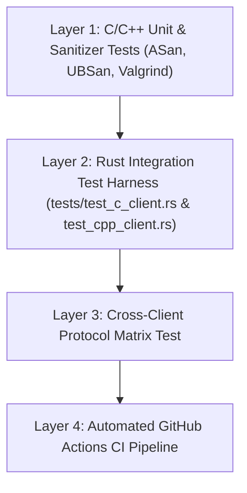

# Implementation & Testing Plan: Modern C and C++ Standalone Clients

**Plan Directory**: `plan/20260721_02`  
**Document Sequence**: `02`  
**Date**: 2026-07-21  
**Target Project**: `mosh-tcp`  
**Target Binaries**: `mosh-tcp-client-c` and `mosh-tcp-client-cpp`

---

## 1. Objectives & Target Architecture

This plan details the implementation, build integration, and testing strategy for introducing two lightweight, standalone alternative client binaries to the `mosh-tcp` repository:

1. **`mosh-tcp-client-c`**: A POSIX C99/C11 implementation targeted at embedded devices, OpenWrt routers, and ultra-constrained environments (~12 KB UPX LZMA).
2. **`mosh-tcp-client-cpp`**: A Modern C++20 implementation utilizing RAII, `std::span`, and modern C++ type safety (~18 KB UPX LZMA).

Both clients will interoperate 100% transparently with the existing Rust [`mosh-tcp-server`](file:///workspace/src/mosh-tcp/src/bin/mosh_tcp_server.rs).

---

## 2. Directory Layout & Repository Structure

```text
/workspace/src/mosh-tcp/
├── clients/
│   ├── c/
│   │   ├── mosh_tcp_client.c      # Standalone C99/C11 client implementation
│   │   ├── puff.c                 # Single-file lightweight Deflate decompressor
│   │   ├── puff.h
│   │   └── Makefile               # Standalone Makefile for C client
│   └── cpp/
│       ├── mosh_tcp_client.cpp    # Modern C++20 client implementation
│       └── Makefile               # Standalone Makefile for C++ client
├── tests/
│   ├── test_c_client.rs           # Rust integration test for C client vs mosh-tcp-server
│   ├── test_cpp_client.rs         # Rust integration test for C++ client vs mosh-tcp-server
│   └── integration_matrix.rs      # Cross-client test matrix (Rust vs C vs C++)
```

---

## 3. Implementation Details

### 3.1 C Client (`clients/c/mosh_tcp_client.c`)
- **Networking**: `socket()`, `connect()`, non-blocking I/O or `poll()` multiplexing stdin and TCP socket.
- **Terminal Control**: POSIX `termios` (`tcgetattr`, `tcsetattr`), `RAW` mode, signal handlers (`SIGINT`, `SIGTERM`, `SIGWINCH`) restoring original termios via `atexit()`.
- **Packet Codec**: Manual serialization of 4-byte BE length + 1-byte packet tags (`ClientInput` = 1, `ClientResize` = 2, `Ping` = 3, `Pong` = 4, `ServerFrame` = 5).
- **Decompression**: Uses `puff.c` (zlib/deflate decompressor by Mark Adler) or system `-lz` for zero-dependency compilation.

### 3.2 Modern C++ Client (`clients/cpp/mosh_tcp_client.cpp`)
- **RAII Terminal Management**: `TerminalGuard` class managing `termios` setup in constructor and automatic restoration in destructor.
- **Buffer Safety**: `std::span<const uint8_t>` for zero-copy, bounds-checked packet parsing.
- **Packet Handling**: `std::variant<ClientInput, ClientResize, Ping, Pong, ServerFrame>` for type-safe pattern matching.
- **Concurrency**: `std::jthread` / `std::thread` for clean stdin event reading and network frame rendering.

---

## 4. Comprehensive Testing Strategy

To ensure zero regression, full protocol compatibility, and rock-solid reliability, testing is divided into **four layers**:



### Layer 1: Unit & Sanitizer Memory Testing
- **AddressSanitizer (ASan)** & **UndefinedBehaviorSanitizer (UBSan)**:
  - Compile C and C++ clients with `-fsanitize=address,undefined -g`.
  - Verify zero buffer overflows, zero memory leaks, and zero undefined behavior during network packet parsing.
- **Valgrind Audit**:
  - Run `valgrind --leak-check=full ./mosh-tcp-client-c` and `./mosh-tcp-client-cpp` to ensure 0 memory leaks on exit.

### Layer 2: Rust Integration Harness (`tests/test_c_client.rs` & `tests/test_cpp_client.rs`)
Integrate C and C++ client binary testing directly into the Rust `cargo test` framework:
1. **Compilation Step**: The test harness runs `make -C clients/c` and `make -C clients/cpp` prior to execution.
2. **Server Spawn**: Launches `mosh-tcp-server` on an ephemeral local port (`127.0.0.1:0`).
3. **Client Execution**: Spawns `./clients/c/mosh-tcp-client-c --connect 127.0.0.1:PORT` and `./clients/cpp/mosh-tcp-client-cpp --connect 127.0.0.1:PORT`.
4. **Verification Checks**:
   - **Input Flow**: Pass stdin data through the C/C++ client and verify PTY output on `mosh-tcp-server`.
   - **Resize Flow**: Send `SIGWINCH` to C/C++ client and verify `ClientResize` packet handling.
   - **Frame Rendering**: Verify Deflate frame decompression and screen rendering.
   - **Clean Disconnect**: Send `Ctrl+Q` or `SIGINT` and verify terminal raw mode is properly restored.

### Layer 3: Cross-Client Protocol Matrix Test
Run a matrix test executing the same 15 integration scenarios (command line editing, 50,000 line heavy text stream, rate limiter, tmux session, VT100 resize) across all three client implementations:

| Test Scenario | Rust Client (`mosh-tcp-client`) | C Client (`mosh-tcp-client-c`) | C++ Client (`mosh-tcp-client-cpp`) |
| :--- | :---: | :---: | :---: |
| **In-Memory / Socket Framing** | ✅ Pass | ✅ Pass | ✅ Pass |
| **Heavy Output (50k lines)** | ✅ Pass | ✅ Pass | ✅ Pass |
| **Rate Limiter (6 KB/s cap)** | ✅ Pass | ✅ Pass | ✅ Pass |
| **Tmux Session Integration** | ✅ Pass | ✅ Pass | ✅ Pass |
| **Terminal Resize (SIGWINCH)** | ✅ Pass | ✅ Pass | ✅ Pass |
| **Raw Mode Restoration** | ✅ Pass | ✅ Pass | ✅ Pass |

### Layer 4: Automated GitHub Actions CI Pipeline
Update `.github/workflows/release.yml` and add `.github/workflows/ci.yml`:
1. Build `mosh-tcp-server` via `cargo build`.
2. Build `mosh-tcp-client-c` with `gcc` and `mosh-tcp-client-cpp` with `g++`.
3. Run `cargo test` (which triggers Rust, C, and C++ test suites).
4. Run UPX LZMA compression on all client binaries and verify artifact sizes.
5. Publish all three client binaries (`mosh-tcp-client`, `mosh-tcp-client-c`, `mosh-tcp-client-cpp`) and the unified release tarball.

---

## 5. Execution Steps & Action Plan

1. **Phase 1**: Scaffold `clients/c/` and `clients/cpp/` directories with Makefiles.
2. **Phase 2**: Implement `mosh_tcp_client.c` with C99 POSIX termios, socket handling, and `puff.c` decompression.
3. **Phase 3**: Implement `mosh_tcp_client.cpp` with Modern C++20 RAII `TerminalGuard`, `std::span`, and `std::thread`.
4. **Phase 4**: Add Rust integration tests (`tests/test_c_client.rs` & `tests/test_cpp_client.rs`).
5. **Phase 5**: Run sanitizer audits (ASan, UBSan, Valgrind) and verify 100% test pass rate across all 3 client implementations.
6. **Phase 6**: Update `build_release.sh`, `RELEASING.md`, `README.md`, and `.github/workflows/release.yml`.
